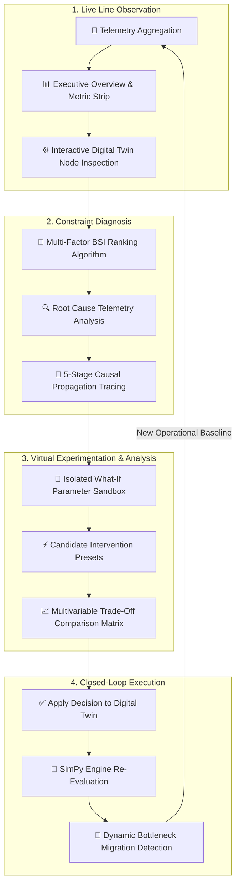

# 🏭 Production Bottleneck Intelligence & Digital Twin Platform

> **A Discrete-Event Digital Twin & Operational Decision Workspace for Multi-Stage Manufacturing Lines.**  
> *Observe live production → Detect primary constraints → Trace causal disruptions → Simulate what-if interventions → Compare trade-offs → Apply decisions → Re-evaluate dynamic bottleneck migration.*

---

## 🔄 End-to-End Operational Workflow

The platform follows a **closed-loop decision cycle** designed for manufacturing engineers, operations managers, and plant superintendents to move from raw line telemetry to verified decision execution without operational risk.



### The 5-Step Operator Journey

1. **Observe Baseline (`/overview` & `/digital-twin`)**  
   Operators monitor real-time plant performance across stations (**M1 → M5**) and buffers (**B1 → B4**). High-level KPIs (Throughput, WIP, Utilization, Primary Bottleneck) provide immediate situational awareness.

2. **Diagnose Constraint (`/intelligence`)**  
   The **Bottleneck Severity Index (BSI)** engine computes empirical constraint scores combining utilization, queue backlog, upstream blocking, and downstream starvation. Operators inspect the 5-stage causal chain to pinpoint the origin of throughput loss.

3. **Simulate Interventions (`/scenarios`)**  
   Operators adjust processing cycle times, machine capacities, buffer limits, or MTTR parameters inside an isolated sandbox without mutating the live factory configuration.

4. **Compare Trade-Offs (`/decisions`)**  
   Candidate scenarios are evaluated in a side-by-side trade-off matrix analyzing Throughput Delta ($\Delta\%$), WIP Reduction ($\Delta\%$), Lead Time Delta ($\Delta\%$), and ROI ($\$/\%$ gain).

5. **Apply & Re-Evaluate (`/decisions` → Dynamic Migration)**  
   Executing **APPLY TO DIGITAL TWIN** re-injects the selected intervention into the core simulation engine. The platform recalculates all telemetry live and verifies whether the bottleneck was resolved or migrated downstream (e.g., from `M3` to `M4`).

---

## 🏗 System Architecture & Tech Stack

```
                               ┌────────────────────────────────────────┐
                               │   REACT + VITE + TS FRONTEND (PORT 3000)│
                               │   • Top Navigation Bar Layout          │
                               │   • 5 Workspaces: Overview | Twin |    │
                               │     Intel | Scenarios | Decisions      │
                               │   • Minimal Light Industrial Brutalism │
                               └───────────────────┬────────────────────┘
                                                   │ HTTP / REST APIs
                                                   ▼
                               ┌────────────────────────────────────────┐
                               │   FASTAPI BACKEND ENGINE (PORT 8000)   │
                               │   Thin REST API Router (/api/*)        │
                               └───────────────────┬────────────────────┘
                                                   │
         ┌─────────────────────────────────────────┼─────────────────────────────────────────┐
         ▼                                         ▼                                         ▼
┌─────────────────────────┐               ┌─────────────────────────┐               ┌─────────────────────────┐
│ SIMULATION SERVICE      │               │ BSI ANALYTICS ENGINE    │               │ SCENARIO ENGINE         │
│ • SimPy Discrete Engine │               │ • Multi-Metric Ranking  │               │ • What-If Sandbox       │
│ • Station Queue Logic   │               │ • Upstream Blocking     │               │ • Trade-off Matrix      │
│ • Operational Telemetry │               │ • Downstream Starvation │               │ • Model Re-evaluation   │
└─────────────────────────┘               └─────────────────────────┘               └─────────────────────────┘
```

### Tech Stack Details
- **Backend Application**: Python 3.14, FastAPI (ASGI web framework), Pydantic v2 (schema validation), Uvicorn.
- **Simulation & Modeling Engine**: `SimPy` (Discrete-Event Simulation engine for queueing networks & process modeling).
- **Frontend Workspace**: React 18, Vite, TypeScript, Recharts (data visualization), Lucide Icons, Custom CSS tokens.
- **Automated Testing Suite**: Pytest (48 backend integration & unit tests), TypeScript Compiler (`tsc --noEmit`).

---

## ⚙️ Core Analytics & Mathematical Formulations

### 1. Discrete-Event Simulation Engine (`SimPy`)
The backend models a 5-stage sequential manufacturing system:

$$\text{M1} \longrightarrow \text{B1} \longrightarrow \text{M2} \longrightarrow \text{B2} \longrightarrow \text{M3} \longrightarrow \text{B3} \longrightarrow \text{M4} \longrightarrow \text{B4} \longrightarrow \text{M5}$$

- **Stations ($M_1 \dots M_5$)**: Modeled as limited-capacity resources with processing cycle times, breakdown probability distributions, and MTTR repair cycles.
- **Buffers ($B_1 \dots B_4$)**: Limited-capacity storage queues governing upstream blocking and downstream starvation mechanics.

### 2. Multi-Metric Bottleneck Severity Index (BSI)
Rather than relying on simple utilization heuristics, BSI calculates a multi-dimensional constraint score for each station $i$:

$$\text{BSI}_i = w_1 \cdot U_i + w_2 \cdot Q_i + w_3 \cdot B_i + w_4 \cdot S_i$$

Where:
- $U_i$: Operational Utilization Percentage.
- $Q_i$: Normalized Buffer Queue Accumulation.
- $B_i$: Upstream Blocking Percentage caused by downstream queue saturation.
- $S_i$: Downstream Starvation Percentage caused by upstream delays.
- $w_1, w_2, w_3, w_4$: Empirical weighting factors ($w_1=0.35, w_2=0.25, w_3=0.25, w_4=0.15$).

### 3. Causal Disruption Propagation Tracing
Traces the downstream and upstream impact chain of an operational bottleneck:

$$\text{Root Disruption (M3)} \longrightarrow \text{Cycle Time Spike} \longrightarrow \text{Buffer Queue (B2) Saturation} \longrightarrow \text{Upstream Blocking (M2)} \longrightarrow \text{Line Output Loss}$$

---

## 🖥 Product Workspaces

| Workspace | Route | Focus & Functionality |
| :--- | :--- | :--- |
| **01 — OVERVIEW** | `/overview` | 10-second high-level system state. Features a 4-metric executive KPI strip, constraint spotlight, 2D line flow diagram, and direct investigation CTAs. |
| **02 — DIGITAL TWIN** | `/digital-twin` | Full-screen interactive factory model. Clicking any station node opens the **Slide-Over Machine Detail Drawer** detailing cycle times, WIP, blocking %, starvation %, and instant scenario actions. |
| **03 — INTELLIGENCE** | `/intelligence` | Comprehensive constraint diagnosis workspace. Displays BSI ranking scores, root cause telemetry grid, and the 5-stage visual causal disruption propagation stepper. |
| **04 — SCENARIOS** | `/scenarios` | Parameter sandbox allowing operators to adjust cycle times, machine capacity, buffer capacity, and MTTR. Includes live delta preview and 1-click preset interventions. |
| **05 — DECISIONS** | `/decisions` | Side-by-side scenario trade-off comparator. Includes interactive Recharts visualizations, **APPLY TO DIGITAL TWIN** model re-evaluation, and before/after dynamic bottleneck migration analysis. |

---

## 🌐 REST API Endpoints Specification

| Method | Endpoint | Description | Request Payload | Response Object |
| :--- | :--- | :--- | :--- | :--- |
| `GET` | `/api/health` | System health & status check | None | `{"status": "ok"}` |
| `GET` | `/api/factory` | Active factory layout configuration | None | `ProductionConfig` |
| `POST` | `/api/simulation/run` | Execute SimPy simulation shift | `{"simulation_time": 480}` | `SimulationResult` |
| `GET` | `/api/analysis/bottleneck/{run_id}` | Multi-metric BSI bottleneck ranking | None | `BottleneckAnalysis` |
| `GET` | `/api/analysis/propagation/{run_id}` | Event disruption propagation chain | `?machine_id=M3` | `PropagationAnalysis` |
| `POST` | `/api/scenarios/run` | Execute isolated what-if scenario | `{"scenario_name": "...", ...}` | `ScenarioRunResponse` |
| `POST` | `/api/scenarios/compare` | Multivariable scenario trade-off matrix | `{"scenarios_list": [...]}` | `ScenarioComparisonMatrix` |
| `POST` | `/api/scenarios/{id}/apply` | Decision execution & twin re-evaluation | `{"modified_machines": [...]}` | `ApplyScenarioResponse` |

---

## � Quick Start Guide

### Prerequisites
- Python 3.10+
- Node.js 18+ & npm

### 1. Start Backend API Server
```bash
cd backend
python -m uvicorn app.main:app --host 127.0.0.1 --port 8000 --reload
```
*Backend API Health Check*: [http://localhost:8000/api/health](http://localhost:8000/api/health)

### 2. Start Frontend Application
```bash
cd frontend
npm install
npm run dev
```
*Frontend Workspace*: [http://localhost:3000/](http://localhost:3000/)

### 3. Run Automated Test Suite
```bash
# Execute Backend Pytest Suite (48 tests passing)
cd backend
$env:PYTHONPATH="backend"; python -m pytest backend/tests

# Execute Frontend TypeScript Type Check (0 errors)
cd frontend
npx tsc --noEmit
```

---

## 📄 License & System Status
**Production Intelligence & Digital Twin Platform** — Built for multi-stage discrete manufacturing process optimization.
